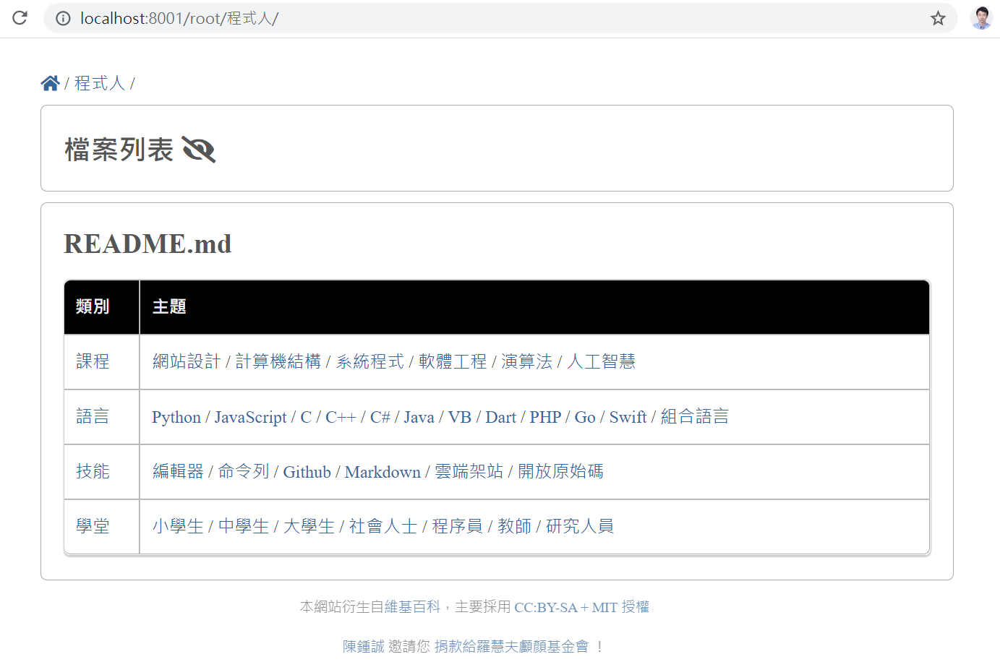

[中文版](./tw/README.md)

# pub6 -- A Server Publish Markdown Content on Web

## Install

```
$ deno install -f --allow-read --allow-net --unstable https://deno.land/x/pub6/pub6.js
```

## Server

```
$ pub6 <path_to_the_root_folder> <port>
```

Example:

```
$ pub6 ../web 8001
root=../web port=8001
start at : http://localhost:8001
absPath= ..\web\index.html
2021-09-03T09:53:09.249Z /root/index.html
absPath= ..\web\程式人\README.md
2021-09-03T09:53:09.311Z /root/程式人/README.md
absPath= ..\web\程式人\課程\計算機結構.md
2021-09-03T09:53:10.993Z /root/程式人/課程/計算機結構.md
```

Screen Shot



## Import Module

Example:

```
import { serve } from 'https://deno.land/x/pub6/mod.ts'

serve(Deno.args[0], parseInt(Deno.args[1]))
```

## Chart

[chart.html](./chart.html)
