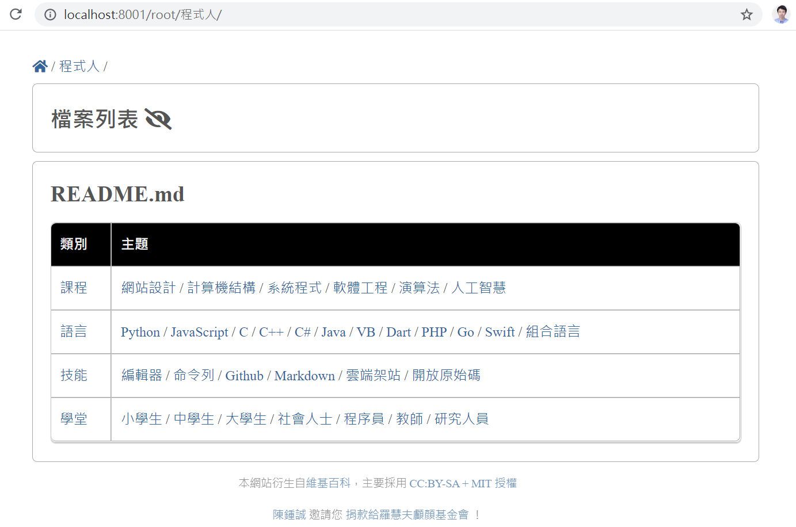

[English](../README.md)

# pub6 -- 一个在网上发布Markdown内容的服务器

## 安装

```
$ deno install -f --allow-read --allow-net --unstable https://deno.land/x/pub6/pub6.js
```

## 服务器

```
$ pub6 <path_to_the_root_folder> <port>
```

例子。

```
$ pub6 .../web 8001
root=./web port=8001
始于 : http://localhost:8001
absPath= ..\web\index.html
2021-09-03T09:53:09.249Z /root/index.html
absPath= ..web\程式人\README.md
2021-09-03T09:53:09.311Z /root/程式人/README.md
absPath= ..\web程式人\课程计算机结构.md
2021-09-03T09:53:10.993Z /root/程式人/課程/計算機結構.md
```

屏幕截图



## 导入模块

例子。

```
import { serve } from 'https://deno.land/x/pub6/mod.ts'

serve(Deno.args[0], parseInt(Deno.args[1])
```

通过www.DeepL.com/Translator（免费版）翻译